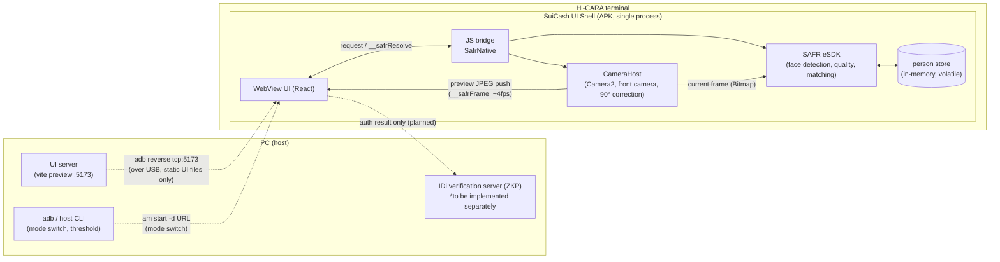
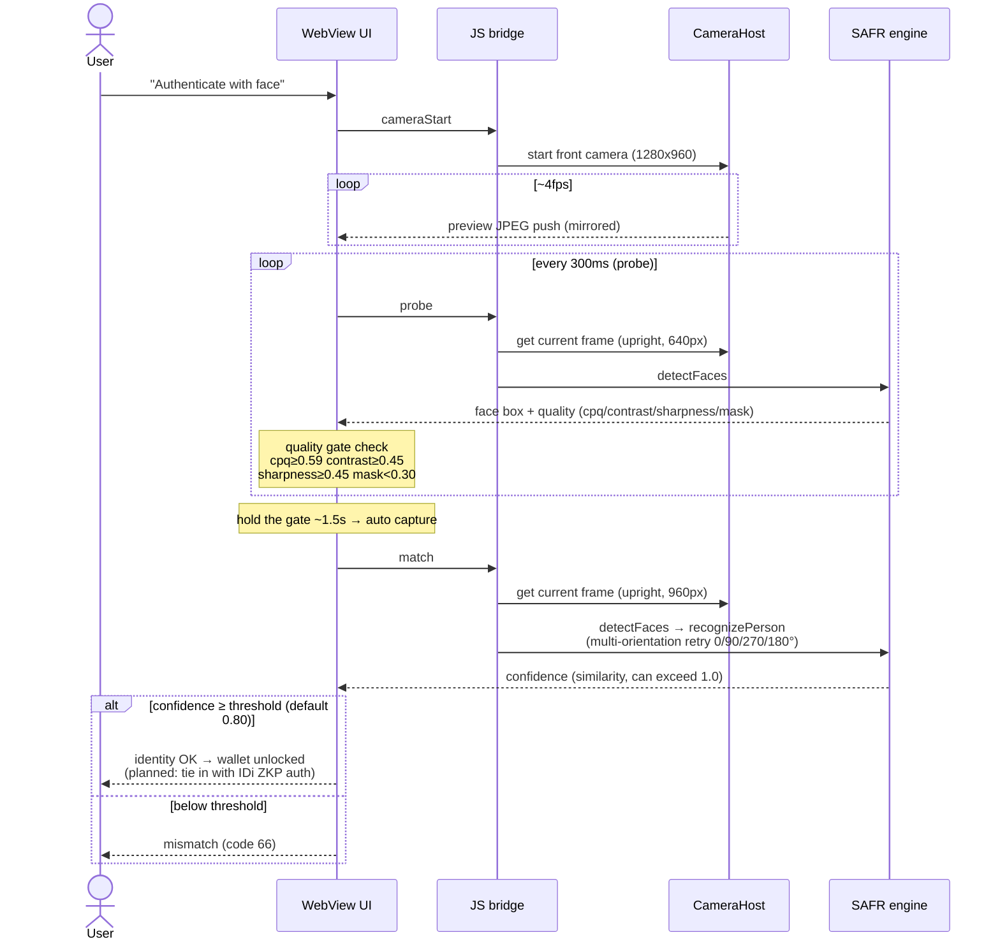

# SuiCash Payment Terminal UI (face-auth-ui)

The UI for the SuiCash payment terminal (Hi-CARA). Built with React and shown
full-screen in a WebView shell on the device (`device-shell/`). Face recognition
uses the commercial engine built into the device (SAFR eSDK). The engine binaries,
models and license cannot be redistributed, so they are not included in the
repository. Where they are absent, a mock (`src/sim.ts`) runs with the same
response spec (confidence range, quality thresholds, result codes), so UI
development can be done entirely in the browser.

## Terminal role and host PC integration

Hi-CARA cannot read FeliCa directly (the reader is on the host PC). Therefore
**the host PC reads FeliCa, authenticates the IDi via the oracle, and handles the on-chain payment**.
The terminal is a dedicated, event-driven UI (the host PC <-> terminal protocol is in `src/terminal.ts`).

Host PC -> terminal events: `card` (tapped + IDi authenticated) / `mode` (balance inquiry or payment standby + amount) /
`paymentResult` (transfer result) / `cardRemoved`.
Terminal -> host PC reports: `faceOk` / `faceNg` / `enrolled` / `cancel`.

### Screen flow

```
waiting (waiting for a card; shows the host CLI setting = balance inquiry / payment N)
  └ card
      ├ not registered (no on-chain registration) → registerPrompt (guide to register on a smartphone)
      ├ registered & no face on terminal         → enroll (face enrollment, kept on the terminal keyed by IDi)
      └ registered & face present                → auth (face authentication)
    └ face OK
        ├ standby mode → balance (balance inquiry only)
        └ payment mode → paying → lcd (ticket-gate LCD style: amount deducted + remaining balance)
```

Face matching is completed on the terminal, and face data never leaves it (face ZKP is local only).
The on-chain payment is signed by the host PC with the IDi-derived key.

### Checking in the browser

Adding `?debug=1` shows a "host PC simulator" panel where you can manually send `card` / `mode` /
`paymentResult` to exercise the whole flow (verifiable without the device or host PC).

```sh
npm install
npm run dev      # dev server (browser + mock engine)
npm run build    # type check + production build (for the terminal; target chrome74)
```

## Architecture (what runs where)



Key property: **face images and templates never leave the Hi-CARA**.
The only traffic over USB is "PC -> terminal: static UI files and control commands";
no face data flows the other way. The future IDi verification server (ZKP, implemented
separately) will also receive only the authentication result.

## Authentication flow (what is read and how it is judged)



Enrollment (a hidden dev mode) follows the same flow, except the final step is
`clearPersonStore → learnPerson` (always keeps exactly one entry) instead of `match`.
Real face enrollment is expected to be done beforehand on the user's own device.

## Operating modes and host CLI

The terminal UI **has no controls for switching modes or changing the threshold**.
All control is expected to come from the host CLI on the PC (`suicash-facectl`,
implemented separately); the entry point is `src/control.ts`.

This terminal is **authentication only**. Face enrollment is expected to be done
beforehand on the user's own device, so the authentication terminal has no enrollment
path (enrollment is handled on the `face-regist` branch).

- **Normal mode** … customer-facing kiosk screen. Only "Authenticate with face".
  Successful auth → wallet unlocked.
- **Face enrollment mode (dev, hidden)** … staff screen kept for testing.
  Only reachable with `?mode=enroll&debug=1`. Capture to enroll / verify match.

Current bridge implementation (interim until the host CLI is finished):

| Channel | Purpose | Example |
| --- | --- | --- |
| URL query | Startup parameters | `?mode=enroll&threshold=0.85&debug=1` |
| `window.postMessage` | Switching at runtime | `{ source: "suicash-facectl", cmd: "mode", value: "enroll" }` |

There are 3 commands: `mode` / `threshold` / `store.clear`
(`ControlCommand` in `src/control.ts`). In production, just add a thin bridge that
`postMessage`s CLI commands received over WebSocket etc. in the same format.

Adding `?debug=1` shows a debug log panel of engine events.

## Screen flow

```
home (per mode) → camera (auto capture once the quality gate is held)
  → processing → result (large confidence display)
  → [normal mode only] wallet unlocked
```

## Privacy

Face verification is completed on the Hi-CARA terminal. Face images and templates are
never stored or sent off the terminal; enrollment data (person store) is volatile,
kept only in terminal memory, and erased when the app exits. Only the authentication
result is passed to the host PC and the chain.

- The camera shows the `getUserMedia` front camera mirrored. Without permission,
  a silhouette placeholder is shown.
- Quality gate: cpq ≥ 0.59 / contrast ≥ 0.45 / sharpness ≥ 0.45 / mask < 0.30.
  Holding this for a set time triggers auto capture.
- Result codes: 0 success / 65 enrollment failed / 66 insufficient accuracy / 160 face detection failed.
- confidence is a similarity score, not a 0–1 probability, and can exceed 1.0.
  A match is declared at or above the threshold (default 0.80).

## Engine connection

`MockSafrEngine` in `src/sim.ts` is the sole interface between the UI and the engine.
On the device, it connects to the real engine (SAFR eSDK) via the JS bridge exposed by
the WebView shell and calls `detectFaces / learnPerson / recognizePerson / clearPersonStore`.
Where no bridge is present, it automatically falls back to the mock.

## Directory layout

```
src/
  App.tsx               screen flow (state machine)
  control.ts            host CLI control entry point
  sim.ts                mock engine (reproduces the engine response spec)
  types.ts              OpMode type
  components/
    CameraView.tsx      camera preview + face guide + detection box
    QualityMeter.tsx    quality gate bars
    ResultView.tsx      enrollment/match result screen
    LogPanel.tsx        debug log (?debug=1 only)
    Logo.tsx            SuiCash wordmark (REM 605, iC outline)
device-shell/           WebView shell APK for the terminal (build bundles the engine)
```
