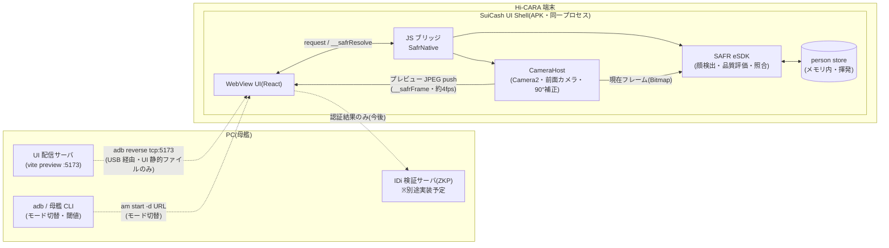
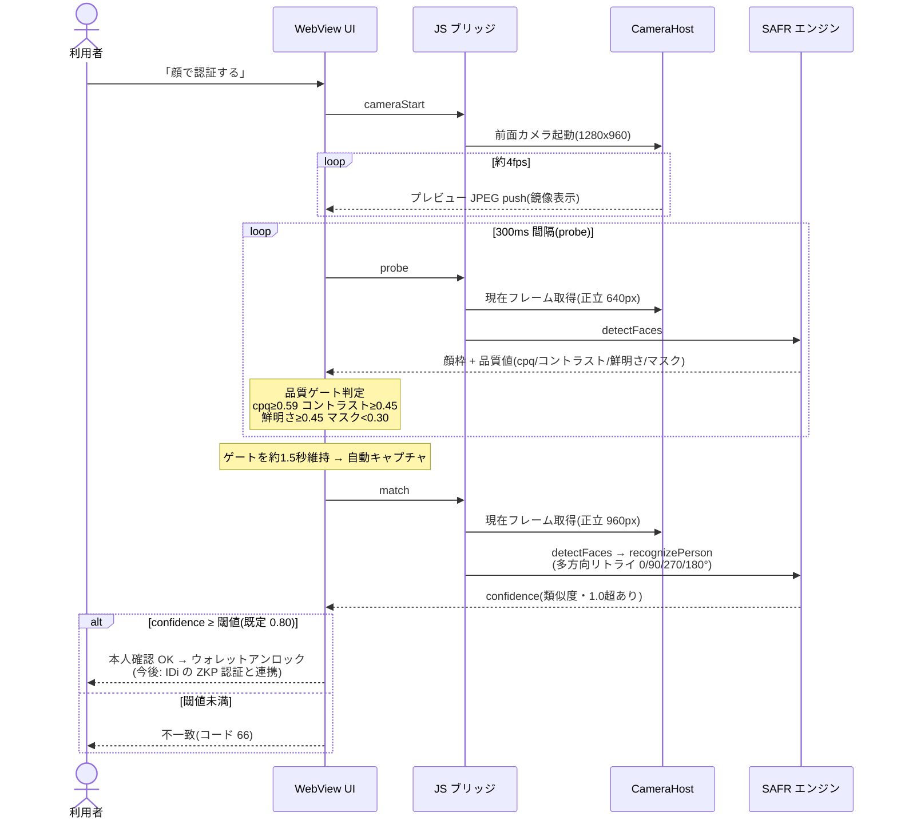

# SuiCash 顔認証フロントエンド (face-auth-ui)

SuiCash 端末(Hi-CARA)の顔認証 UI。React 製で、端末上の WebView シェル
(`device-shell/`)に全画面表示して使う。顔認証エンジンには端末組み込みの
商用エンジン(SAFR eSDK)を利用する。エンジンのバイナリ・モデル・ライセンスは
再配布できないためリポジトリには含めておらず、無い環境ではモック
(`src/sim.ts`)が同じ応答仕様(confidence レンジ・品質しきい値・結果コード)で
動くので、UI 開発はブラウザだけで完結する。

```sh
npm install
npm run dev      # 開発サーバ(ブラウザ + モックエンジン)
npm run build    # 型チェック + 本番ビルド(端末向け。ターゲットは chrome74)
```

## 構成図(なにがどこで動くか)



重要な性質: **顔の画像・テンプレートは Hi-CARA から出ない**。
USB 上を流れるのは「PC→端末: UI の静的ファイルと操作コマンド」だけで、
逆方向に顔データは流れない。今後の IDi 検証サーバ(ZKP、別途実装)に渡すのも
認証結果だけ。

## 認証の流れ(なにをどう読んで判定するか)



登録(顔登録モード)も同じ流れで、最後が `match` の代わりに
`clearPersonStore → learnPerson`(常に 1 件だけ保持)になる。

## 運用モードと母艦 CLI

端末 UI には**モード切替・閾値変更の操作を置かない**。制御はすべて PC 側の
母艦 CLI(`suicash-facectl`、別途実装)から入る想定で、受け口は `src/control.ts`。

- **通常運用モード** … 利用者向けキオスク画面。「顔で認証する」のみ。
  認証成功 → ウォレットアンロック。
- **顔登録モード** … 係員向け。撮影して登録/登録した顔で確認照合。
  画面上部に登録モードバナーを常時表示。

現在のブリッジ実装(母艦 CLI 完成までの暫定):

| 経路 | 用途 | 例 |
| --- | --- | --- |
| URL クエリ | 起動時パラメータ | `?mode=enroll&threshold=0.85&debug=1` |
| `window.postMessage` | 実行中の切替 | `{ source: "suicash-facectl", cmd: "mode", value: "enroll" }` |

コマンドは `mode` / `threshold` / `store.clear` の 3 種
(`src/control.ts` の `ControlCommand`)。実運用では WebSocket 等で受けた
CLI コマンドを同形式で `postMessage` する薄いブリッジを足すだけでよい。

`?debug=1` を付けるとエンジンイベントのデバッグログパネルが出る。

## 画面フロー

```
home(モード別) → camera(品質ゲート維持で自動キャプチャ)
  → processing → result(confidence 大表示)
  → [通常運用のみ] ウォレットアンロック
```

## プライバシー

顔の検証は Hi-CARA 端末内で完結する。顔画像・顔テンプレートは端末の外へ
保存・送信せず、登録データ(person store)は端末メモリ内のみの揮発で
アプリ終了時に消える。母艦・チェーン側に渡るのは認証結果だけ。

- カメラは `getUserMedia` の前面カメラを鏡像表示。権限がない環境では
  シルエットのプレースホルダになる。
- 品質ゲート: cpq ≥ 0.59 / コントラスト ≥ 0.45 / 鮮明さ ≥ 0.45 / マスク < 0.30。
  これを一定時間維持すると自動キャプチャする。
- 結果コード: 0 成功 / 65 登録失敗 / 66 精度不足 / 160 顔検出失敗。
- confidence は 0〜1 の確率ではなく類似度スコアで、1.0 を超えることがある。
  閾値(既定 0.80)以上で一致と判定する。

## エンジン接続

`src/sim.ts` の `MockSafrEngine` が UI とエンジンの唯一の接点。端末上では
WebView シェルが公開する JS ブリッジ経由で実エンジン(SAFR eSDK)に接続し、
`detectFaces / learnPerson / recognizePerson / clearPersonStore` を呼ぶ。
ブリッジが無い環境では自動的にモックへフォールバックする。

## ディレクトリ

```
src/
  App.tsx               画面フロー(state machine)
  control.ts            母艦 CLI 制御の受け口
  sim.ts                モックエンジン(エンジン応答仕様の再現)
  types.ts              OpMode 型
  components/
    CameraView.tsx      カメラプレビュー + 顔ガイド + 検出枠
    QualityMeter.tsx    品質ゲートのバー表示
    ResultView.tsx      登録/照合の結果画面
    LogPanel.tsx        デバッグログ(?debug=1 のみ)
    Logo.tsx            SuiCash ワードマーク(REM 605、iC アウトライン)
device-shell/           端末用 WebView シェル APK(エンジン同梱ビルド)
```
