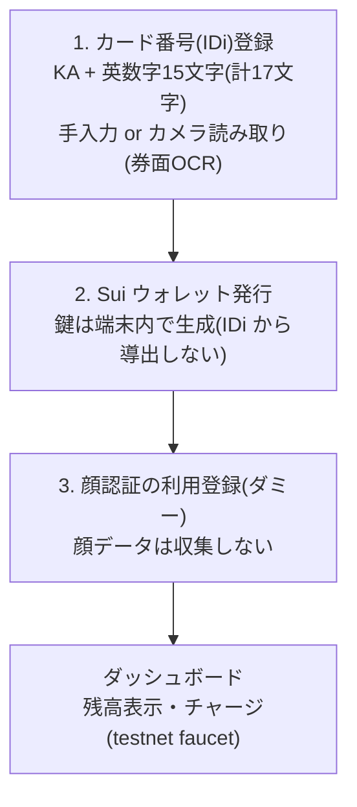

# SuiCash 登録サイト (regist-web)

利用者のスマホ向け登録フロントエンド。カード番号(IDi)の登録 →
Sui ウォレット発行 → 顔認証の利用登録(ダミー)→ チャージ、までを行う。
決済時の顔照合は店舗の認証端末(Hi-CARA、`face-auth-ui/`)の中だけで行われる。

```sh
npm install
npm run dev      # 開発サーバ
npm run build    # 型チェック + 本番ビルド
```

## Docker(ポート 1919)

```sh
docker build -t suicash-regist-web .
docker run --rm -p 1919:1919 suicash-regist-web
# → http://localhost:1919
```

> **カメラ読み取りの注意**: 券面 OCR は `getUserMedia` を使うため
> **secure context(HTTPS または localhost)必須**。スマホから
> `http://<PCのIP>:1919` の平文 HTTP で開くとカメラは使えない
> (手入力は使える)。スマホでカメラ OCR を試すときは
> ngrok / Tailscale / リバースプロキシ等で HTTPS 化するか、
> `adb reverse` で端末の localhost に見せること。

## 登録フロー



## プライバシー設計

- **IDi(カード番号)は外部へ送らない**。外部(チェーン・IDi 検証サーバー)に
  渡すのは `hash(IDi, salt)` のコミットメントのみ。生の IDi と salt は
  この端末の localStorage にだけ保存する
  (コミットメント方式は暫定 SHA-256。検証サーバー側の ZKP 回路が
  決まり次第 Poseidon 等へ差し替える — `src/lib/idi.ts`)
- **顔データは収集しない**。ステップ 3 はプライバシー保護のための
  意図的なダミー登録(カメラも起動しない)。実際の顔照合は決済時に
  認証端末の内部だけで行われ、そこでも顔データは端末外へ出ない
- **鍵は IDi から導出しない**。IDi はリーダーで誰でも読める値のため、
  ウォレット鍵はランダム生成し、IDi(コミットメント)→ウォレットの
  対応付けはルータ/検証サーバー(別担当)がチェーン上で解決する設計
- 券面 OCR の撮影画像もブラウザ内でのみ処理し、外部送信しない

## 券面 OCR(カメラ読み取り)

認証端末(Hi-CARA)で実績のある読み方を Web(canvas + Tesseract.js)に移植:

1. カードガイド枠(「券面を枠の中に合わせてください」)に合わせて撮影
2. 枠に対する固定位置(`ID_ROI`)で ID 行だけを切り出し
3. 適応二値化 + 白抜き印字の自動反転で「白地×黒文字」に正規化
4. 英数字ホワイトリストで 1 行 OCR → 英字→数字の見間違い補正 → 17 文字整形
5. **結果は入力欄にプリフィルし、必ず利用者が確認・修正して確定**

ROI・ガイド枠の位置は `src/lib/ocr.ts`(計算)と `src/styles.css` の
`.scan__guide` / `.scan__idbox`(表示)で一致させてある。ズレたら両方直すこと。

## ディレクトリ

```
src/
  App.tsx                 ステップ進行(IDi → ウォレット → 顔 → ダッシュボード)
  lib/
    idi.ts                IDi の検証・整形・コミットメント計算
    ocr.ts                券面 OCR(前処理 + Tesseract.js + 整形)
    wallet.ts             Sui ウォレット(testnet)・残高・faucet チャージ
    storage.ts            登録状態の localStorage 永続化
  components/
    IdiStep.tsx           IDi 登録(手入力 + カメラ読み取り)
    WalletStep.tsx        ウォレット発行
    FaceStep.tsx          顔認証の利用登録(ダミー・非収集)
    Dashboard.tsx         残高・チャージ・登録情報
    Logo.tsx              SuiCash ワードマーク
Dockerfile / nginx.conf   ポート 1919 で配信
```
