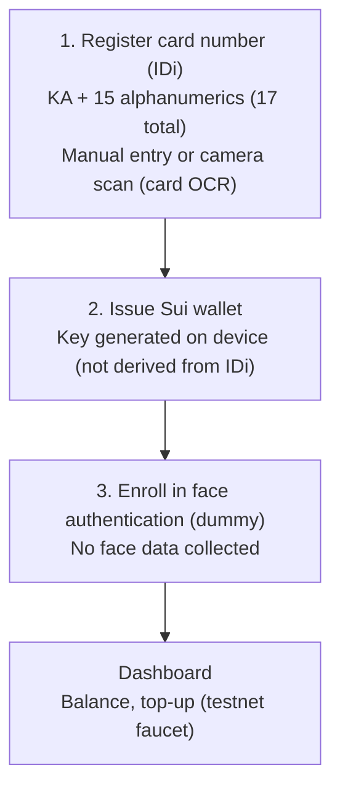

# SuiCash Registration Site (regist-web)

Registration frontend for users' smartphones. Covers registering the card number (IDi) →
issuing a Sui wallet → enrolling in face authentication (dummy) → topping up.
Face matching at payment happens only inside the store's auth terminal (Hi-CARA, `face-auth-ui/`).

```sh
npm install
npm run dev      # dev server
npm run build    # type check + production build
```

## Deployment

### Production: GitHub Pages (auto-deploy)

Pushing to `regist-web/**` on `face-regist` makes Actions
(`.github/workflows/pages-regist-web.yml`) build and publish to GitHub Pages.
**HTTPS is provided automatically**, so card camera OCR on phones (`getUserMedia`
requires a secure context) just works. No server, Docker, or SSH needed.

- Public URL: **https://yuki-js.github.io/suicash/**
- One-time setup on GitHub: Settings → Pages → Build and deployment →
  **Source: GitHub Actions**
- Since we publish from `face-regist` (not the default branch), if the
  `github-pages` environment's protection rules reject deploys from this branch,
  allow `face-regist` under Settings → Environments → github-pages → Deployment branches
  (or merge into main)
- To bake in the treasury key / RPC / faucet, set `VITE_TREASURY_SECRET` (Secret)
  and `VITE_SUI_RPC` / `VITE_SUI_FAUCET` (Variables) under Settings → Secrets and
  variables → Actions
- Output uses relative paths (`base: "./"`), so it works under the `/suicash/` subpath.
  The workflow generates `404.html` and `.nojekyll` for SPA fallback

### Local testing

```sh
npm run dev        # dev server (HMR, :5173)
npm run preview    # preview the production build (:4173)
```

> **Camera scanning note**: card OCR uses `getUserMedia`, so it
> **requires a secure context (HTTPS or localhost)**. GitHub Pages is HTTPS,
> so that's fine. Locally, `http://localhost` works (plain HTTP on a LAN IP does not).

## Registration flow



## Sui endpoints (handling 429 rate limits)

The public testnet endpoints (fullnode RPC / faucet) used for top-ups and balance
queries return **429 (rate limited)** when traffic from a shared IP piles up. For a
stable demo, you can swap in your own or another RPC / faucet (priority: URL query >
localStorage > build-time env > default):

| Target | URL query | localStorage | Build-time env |
| --- | --- | --- | --- |
| fullnode RPC | `?rpc=<url>` | `suicash.rpc` | `VITE_SUI_RPC` |
| faucet | `?faucet=<url>` | `suicash.faucet` | `VITE_SUI_FAUCET` |

Example: `https://<host>/?rpc=https://your-node/....&faucet=https://your-faucet/...`
(once passed via query it is saved to localStorage, so later visits don't need it)

On a 429 the UI shows a cooldown ("Retry in N s"). The faucet throttles repeated
requests to the same address / IP, so leave some time between attempts.

### Avoiding 429 entirely: treasury transfers (recommended)

To avoid the public faucet's 429s completely, **transfer from a pre-funded testnet
account (the treasury)**. It never hits the faucet, so no 429s.

1. Create a treasury key and fund it with testnet SUI:
   ```sh
   sui client new-address ed25519           # note the suiprivkey1...
   sui client switch --address <that address>
   sui client faucet                         # a few times; stock enough for the demo audience
   sui keytool export --key-identity <address>   # get the suiprivkey1...
   ```
2. Inject that `suiprivkey1...` at runtime (**never commit it to the repo**):

   | Method | Setting |
   | --- | --- |
   | URL query | `?treasury=suiprivkey1...` (saved to localStorage after once) |
   | Build-time env | `VITE_TREASURY_SECRET=suiprivkey1...` |

3. When set, "Top up" automatically switches to treasury transfers (0.2 SUI each).
   When unset, it falls back to the faucet as before.

> Testnet only, for demos. The key ends up in the browser (it's a static site), so
> never use a key holding real value. Refill with `sui client faucet` when it runs dry.

## Privacy design

- **The IDi (card number) is never sent externally**. Only the `hash(IDi, salt)`
  commitment goes to external parties (chain, IDi verification server). The raw IDi
  and salt are stored only in this device's localStorage
  (the commitment scheme is provisionally SHA-256; it will be swapped for Poseidon etc.
  once the verification server's ZKP circuit is settled — `src/lib/idi.ts`)
- **No face data is collected**. Step 3 is an intentional dummy enrollment for
  privacy (the camera isn't even started). Real face matching happens only inside the
  auth terminal at payment time, and even there face data never leaves the terminal
- **Keys are not derived from the IDi**. Since anyone with a reader can read the IDi,
  the wallet key is randomly generated, and the IDi (commitment) → wallet mapping is
  resolved on-chain by the router / verification server (separate owner)
- Card OCR images are also processed only in the browser and never sent externally

## Card OCR (camera scanning)

A port of the approach proven on the auth terminal (Hi-CARA) to the web (canvas + Tesseract.js):

1. Capture with the card aligned to the guide frame ("Align the back of the card within the frame")
2. Crop only the ID line at a fixed position relative to the frame (`ID_ROI`)
3. Normalize to black-on-white via adaptive binarization + auto-inversion of white-on-dark print
4. Single-line OCR with an alphanumeric whitelist → fix letter/digit misreads → shape to 17 chars
5. **Prefill the result into the input; the user always checks, corrects, and confirms it**

The ROI / guide frame positions are kept in sync between `src/lib/ocr.ts` (math) and
`.scan__guide` / `.scan__idbox` in `src/styles.css` (display). If they drift, fix both.

## Directory layout

```
src/
  App.tsx                 step flow (IDi → wallet → face → dashboard)
  lib/
    idi.ts                IDi validation, formatting, commitment
    ocr.ts                card OCR (preprocessing + Tesseract.js + cleanup)
    wallet.ts             Sui wallet (testnet), balance, faucet top-up
    storage.ts            localStorage persistence of registration state
  components/
    IdiStep.tsx           IDi registration (manual entry + camera scan)
    WalletStep.tsx        wallet issuance
    FaceStep.tsx          face authentication enrollment (dummy, no collection)
    Dashboard.tsx         balance, top-up, registration info
    Logo.tsx              SuiCash wordmark
Dockerfile / nginx.conf   serves on port 1919
```
