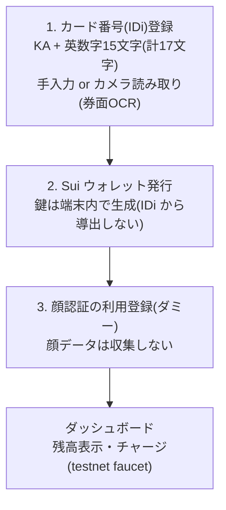

# SuiCash 登録サイト (regist-web)

利用者のスマホ向け登録フロントエンド。カード番号(IDi)の登録 →
Sui ウォレット発行 → 顔認証の利用登録(ダミー)→ チャージ、までを行う。
決済時の顔照合は店舗の認証端末(Hi-CARA、`face-auth-ui/`)の中だけで行われる。

```sh
npm install
npm run dev      # 開発サーバ
npm run build    # 型チェック + 本番ビルド
```

## デプロイ

`npm run build` の出力 `dist/` は**純粋な静的サイト**(相対パス出力)。
サーバープロセスは不要で、置き方は 3 通りある。用途に合わせて選ぶ。

### 方法 A(推奨): 静的ホスティング

Cloudflare Pages / GitHub Pages / Netlify / Vercel などに `dist/` を上げる。
**HTTPS が自動で付く**ので、スマホの券面カメラ OCR(`getUserMedia` は
secure context 必須)がそのまま動く。Docker もサーバー常駐も要らない。

- ビルドコマンド: `npm ci && npm run build`
- 公開ディレクトリ: `dist`
- SPA フォールバック: 404 → `/index.html`(各ホストの設定で指定)

### 方法 B: Node のある任意サーバー(Docker 不要・ポート 1919)

```sh
npm ci && npm run build
npm start          # = vite preview --host --port 1919
# → http://<サーバー>:1919
```

### 方法 C: 既存の Web サーバー(nginx / caddy 等)で配信

`dist/` をドキュメントルートに置き、SPA フォールバック(全パス → index.html)
を設定するだけ。`nginx.conf`(ポート 1919・フォールバック済み)を同梱している。

### 方法 D: Docker(使える環境なら)

```sh
docker build -t suicash-regist-web .
docker run --rm -p 1919:1919 suicash-regist-web
```

> **カメラ読み取りの注意**: 券面 OCR は `getUserMedia` を使うため
> **secure context(HTTPS または localhost)必須**。平文 HTTP の
> `http://<IP>:1919` をスマホで開くとカメラは使えない(手入力は動く)。
> スマホでカメラ OCR を使うなら方法 A の HTTPS ホスティングが最も簡単。
> 自前サーバーで HTTP しか無い場合は Caddy 等でリバースプロキシして
> HTTPS を付けるか、手入力で運用する。

## 登録フロー



## Sui エンドポイント(429 レート制限対策)

チャージや残高取得に使う公開 testnet エンドポイント(fullnode RPC / faucet)は
共有 IP からのアクセスが集中すると **429(レート制限)** を返す。デモで安定させたい
場合は、自前 or 別の RPC / faucet に差し替えられる(優先順:URL クエリ >
localStorage > ビルド時 env > 既定):

| 対象 | URL クエリ | localStorage | ビルド時 env |
| --- | --- | --- | --- |
| fullnode RPC | `?rpc=<url>` | `suicash.rpc` | `VITE_SUI_RPC` |
| faucet | `?faucet=<url>` | `suicash.faucet` | `VITE_SUI_FAUCET` |

例: `https://<host>/?rpc=https://your-node/....&faucet=https://your-faucet/...`
(一度クエリで渡すと localStorage に保存され、次回以降は付けなくてよい)

429 が出たときは UI 側でクールダウン(再試行まで N 秒)を表示する。faucet は
同一アドレス・同一 IP への連続要求を制限するので、少し間隔をあけて試すこと。

### 429 を根本回避:トレジャリー送金(推奨)

公開 faucet の 429 を完全に避けるには、**事前入金済みの testnet アカウント
(トレジャリー)から送金**する。faucet を一切叩かないので 429 は出ない。

1. トレジャリー鍵を作って testnet SUI を入れる:
   ```sh
   sui client new-address ed25519           # suiprivkey1... を控える
   sui client switch --address <その address>
   sui client faucet                         # 何度か。デモ人数ぶん貯める
   sui keytool export --key-identity <address>   # suiprivkey1... を取得
   ```
2. その `suiprivkey1...` を実行時に注入(**リポジトリには入れない**):

   | 方法 | 指定 |
   | --- | --- |
   | URL クエリ | `?treasury=suiprivkey1...`(一度で localStorage に保存) |
   | ビルド時 env | `VITE_TREASURY_SECRET=suiprivkey1...` |

3. 設定されていれば「チャージ」は自動でトレジャリー送金(1 回 0.2 SUI)に切り替わる。
   未設定なら従来どおり faucet にフォールバック。

> testnet 専用・デモ用途。鍵はブラウザに載る(静的サイトのため)ので、
> 価値のある鍵は使わないこと。残高が尽きたら `sui client faucet` で補充。

## プライバシー設計

- **IDi(カード番号)は外部へ送らない**。外部(チェーン・IDi 検証サーバー)に
  渡すのは `hash(IDi, salt)` のコミットメントのみ。生の IDi と salt は
  この端末の localStorage にだけ保存する
  (コミットメント方式は暫定 SHA-256。検証サーバー側の ZKP 回路が
  決まり次第 Poseidon 等へ差し替える — `src/lib/idi.ts`)
- **顔データは収集しない**。ステップ 3 はプライバシー保護のための
  意図的なダミー登録(カメラも起動しない)。実際の顔照合は決済時に
  認証端末の内部だけで行われ、そこでも顔データは端末外へ出ない
- **鍵は IDi から導出しない**。IDi はリーダーで誰でも読める値のため、
  ウォレット鍵はランダム生成し、IDi(コミットメント)→ウォレットの
  対応付けはルータ/検証サーバー(別担当)がチェーン上で解決する設計
- 券面 OCR の撮影画像もブラウザ内でのみ処理し、外部送信しない

## 券面 OCR(カメラ読み取り)

認証端末(Hi-CARA)で実績のある読み方を Web(canvas + Tesseract.js)に移植:

1. カードガイド枠(「券面を枠の中に合わせてください」)に合わせて撮影
2. 枠に対する固定位置(`ID_ROI`)で ID 行だけを切り出し
3. 適応二値化 + 白抜き印字の自動反転で「白地×黒文字」に正規化
4. 英数字ホワイトリストで 1 行 OCR → 英字→数字の見間違い補正 → 17 文字整形
5. **結果は入力欄にプリフィルし、必ず利用者が確認・修正して確定**

ROI・ガイド枠の位置は `src/lib/ocr.ts`(計算)と `src/styles.css` の
`.scan__guide` / `.scan__idbox`(表示)で一致させてある。ズレたら両方直すこと。

## ディレクトリ

```
src/
  App.tsx                 ステップ進行(IDi → ウォレット → 顔 → ダッシュボード)
  lib/
    idi.ts                IDi の検証・整形・コミットメント計算
    ocr.ts                券面 OCR(前処理 + Tesseract.js + 整形)
    wallet.ts             Sui ウォレット(testnet)・残高・faucet チャージ
    storage.ts            登録状態の localStorage 永続化
  components/
    IdiStep.tsx           IDi 登録(手入力 + カメラ読み取り)
    WalletStep.tsx        ウォレット発行
    FaceStep.tsx          顔認証の利用登録(ダミー・非収集)
    Dashboard.tsx         残高・チャージ・登録情報
    Logo.tsx              SuiCash ワードマーク
Dockerfile / nginx.conf   ポート 1919 で配信
```
